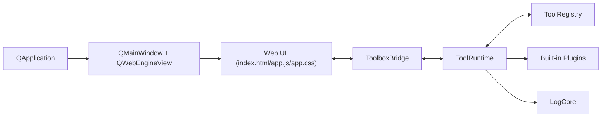

# 自定义工具箱 ARCHITECTURE

最后更新：2026-04-11

## 1. 目标

该项目用于把零散脚本能力沉淀为桌面工具，并通过插件机制降低新增工具成本。  
核心要求：新增插件时，不改核心工具列表，也能被自动发现、自动加载、自动出现在 UI。

## 2. 当前技术栈

- Python 3.11+
- PySide6 + Qt WebEngine + Qt WebChannel
- HTML / CSS / JavaScript
- uv（推荐）或 venv + pip
- PyYAML

## 3. 总体架构



分层职责：

- `app.py/main.py`: 窗口与应用生命周期、WebEngine 宿主。
- `bridge.py`: 前后端协议入口，序列化 bootstrap 与工具调用。
- `plugins/runtime.py`: 插件实例生命周期、动作分发、状态导出。
- `plugins/registry.py`: 扫描 manifest，动态导入插件类。
- `logging/core.py`: JSONL 结构化日志写入/查询。

## 4. 插件注册系统

### 4.1 目录规范

```text
src/toolbox_app/plugins/builtin/
  <tool_id>/
    manifest.json
    plugin.py
    (可选) service.py
```

### 4.2 manifest 关键字段

- `id`: 全局唯一工具 ID
- `name`: 工具展示名
- `entry`: 插件入口类（`module:Class`）
- `summary`: 工具简介
- `category`: 分类
- `permissions`: 能力声明
- `ui.order`: 列表排序权重

### 4.3 自动注册流程

1. `ToolRegistry.discover()` 扫描 `plugins/builtin/*/manifest.json`
2. 构建 `ToolManifest` 并校验 ID 唯一性
3. 解析 `entry` 动态导入插件类
4. `ToolRuntime` 实例化插件并执行 `on_startup()`
5. UI 通过 `getBootstrap()` 获取工具卡片和状态

## 5. 插件化“证据”

当前内置插件：

- `sleep_control`
- `batch_rename`
- `clipboard_history`
- `format_validator`
- `keygen_tool`
- `time_converter`

说明：

- `batch_rename`、`time_converter` 为新增插件示例。
- 它们仅新增了插件目录（`manifest.json + plugin.py`）。
- 未新增对应的核心工具列表硬编码。
- UI 通过通用插件面板自动承载其动作调用。

可执行验证：

```powershell
uv run python scripts/list_builtin_plugins.py
```

## 6. 前后端协议

Bridge 对外接口：

- `getBootstrap()`: 返回 `app/tools/toolStates/loadErrors`
- `invokeTool(tool_id, action, payload_json)`: 执行工具动作
- `stateChanged(payload_json)`: 推送最新全量状态
- `toastRaised(level, message)`: 非阻塞提示

统一动作返回结构：

```json
{
  "ok": true,
  "toolId": "batch_rename",
  "action": "preview",
  "result": {
    "state": {}
  }
}
```

## 7. 日志系统设计

日志路径：

- 目录：`<workspace>/.data/logs/`
- 文件：`events-YYYYMMDD.jsonl`

日志类型：

- `runtime`: 启动、插件加载、状态事件
- `audit`: 关键动作请求与执行
- `error`: 失败与异常堆栈

事件数据结构：

```json
{
  "ts": "2026-04-11T11:30:05+08:00",
  "level": "INFO",
  "log_type": "audit",
  "event": "action.executed",
  "tool_id": "keygen_tool",
  "action": "generate_password",
  "result": "ok",
  "trace_id": "uuid",
  "message": "tool action executed",
  "payload": {}
}
```

## 8. 当前边界与后续

- 当前优先 Windows 桌面。
- 新插件可先通过通用面板接入，再按需补专用 UI。
- 已知限制见 [KNOWN_LIMITATIONS.md](KNOWN_LIMITATIONS.md)。
- 迭代计划见 [ROADMAP.md](ROADMAP.md)。
