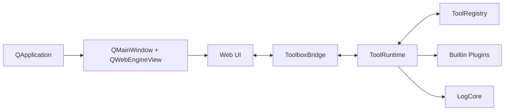

# 自定义工具箱 ARCHITECTURE（PM 版）

## 1. 文档定位

本文件定义项目的产品边界、技术决策和扩展规范，确保新增工具时不破坏现有架构。

## 2. 当前状态（2026-04-11）

### 已落地能力

- 插件自动发现与自动注册（`plugins/builtin/*/manifest.json`）
- 统一调用入口：`invokeTool(tool_id, action, payload)`
- 结构化日志系统（JSONL，写入 `.data/logs/`）
- Web UI 工具网格 + 工具详情页

### 已内置工具

- `sleep_control`：倒计时休眠
- `batch_rename`：批量重命名
- `clipboard_history`：剪贴板历史
- `format_validator`：JSON/YAML 格式化与校验
- `keygen_tool`：密码/密钥工具

## 3. 产品目标与范围

### 目标

- 把零散脚本沉淀为可复用桌面工具。
- 通过插件机制降低新增功能成本。
- 通过统一日志提升可维护性与可追踪性。

### 非目标（当前阶段）

- 云端同步、多人协作、账户系统。
- 复杂权限中心与远程执行。
- 完整跨平台一致性承诺（当前优先 Windows）。

## 4. 技术栈

- Python 3.11+
- PySide6
- Qt WebEngine
- Qt WebChannel
- HTML / CSS / JavaScript
- uv
- PyYAML

### uv 本地配置

项目根目录使用 `uv.toml` 固定 `link-mode = "copy"`。原因是用户可能将 `UV_CACHE_DIR` 放在非项目磁盘，例如缓存位于 `E:`、项目位于 `D:`；Windows 硬链接不能跨卷稳定工作，复制模式可以避免 hardlink warning。

## 5. 总体架构



### 分层职责

- `App Shell`：窗口生命周期、WebEngine 承载、图标与缓存目录。
- `Bridge`：统一协议，负责 UI 与 Runtime 双向通信。
- `ToolRuntime`：插件加载、动作路由、状态汇总、异常隔离。
- `ToolRegistry`：扫描 manifest 并动态导入插件入口类。
- `LogCore`：结构化日志写入与查询。

## 6. 插件注册系统

### 目录规范

```text
src/toolbox_app/plugins/builtin/
  <tool_id>/
    manifest.json
    plugin.py
    (可选) service.py
```

### manifest 关键字段

- `id`：全局唯一工具 ID
- `name`：展示名
- `entry`：插件入口（`module:Class`）
- `summary`：工具简介
- `category`：分类
- `permissions`：能力声明
- `ui.order`：排序权重

### 插件基类约束

每个插件需实现：

- `actions() -> list[str]`
- `invoke(action, payload) -> dict`
- `export_state() -> dict`

可选生命周期：

- `on_startup()`
- `on_shutdown()`

### 自动注册流程

1. 扫描 `plugins/builtin/*/manifest.json`
2. 构建 `ToolManifest` 并校验唯一性
3. 解析 `entry` 动态导入插件类
4. Runtime 实例化插件并订阅状态/提示信号
5. 前端通过 `getBootstrap()` 获取工具清单与状态

## 7. 前后端协议

### Bridge 对外接口

- `getBootstrap()`: 获取 `app/tools/toolStates/loadErrors`
- `invokeTool(tool_id, action, payload_json)`: 执行动作
- `stateChanged(payload_json)`: 推送全量状态
- `toastRaised(level, message)`: 非阻塞提示

### 统一返回结构

```json
{
  "ok": true,
  "toolId": "batch_rename",
  "action": "preview",
  "result": { "state": {} }
}
```

## 8. 日志系统设计

### 日志类型

- `runtime`：运行状态、插件加载、非关键过程
- `audit`：关键动作请求与执行记录
- `error`：异常、失败、堆栈

### 数据模型

```json
{
  "ts": "2026-04-11T11:30:05+08:00",
  "level": "INFO",
  "log_type": "audit",
  "event": "action.executed",
  "tool_id": "keygen_tool",
  "action": "generate_password",
  "result": "ok",
  "trace_id": "...",
  "message": "tool action executed",
  "payload": {}
}
```

### 存储策略

- 目录：`<workspace>/.data/logs/`
- 文件：`events-YYYYMMDD.jsonl`
- 读取能力：`tail`、`query`

## 9. 当前工具能力边界

### `sleep_control`

- `start_countdown`
- `cancel_plan`
- `sleep_now`

### `batch_rename`

- `preview`：计算重命名计划并预览
- `apply`：执行重命名（含冲突检查）
- `clear_preview`

### `clipboard_history`

- 自动捕获系统剪贴板文本
- `set_clipboard`、`toggle_pin`、`remove_item`、`clear`

### `format_validator`

- `process`：JSON/YAML 的格式化或校验
- `clear`

### `keygen_tool`

- `generate_password`
- `generate_token`
- `generate_uuid`
- `hash_text`
- `clear`

## 10. 迭代建议（下一阶段）

- 将 `tool-detail` 前端渲染升级为“基于 manifest 元数据动态生成表单”。
- 引入插件配置持久化（`<workspace>/.data/config/plugins.json`）。
- 为高风险动作增加统一确认中间层（权限声明 + 交互确认 + 审计）。
- 增加插件级自动化测试（动作输入校验、错误回归、状态导出契约）。
